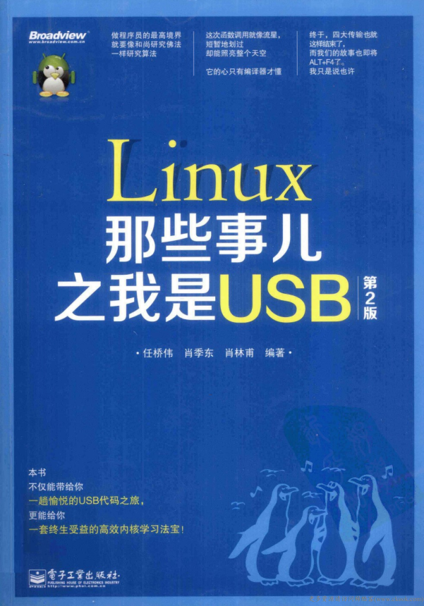
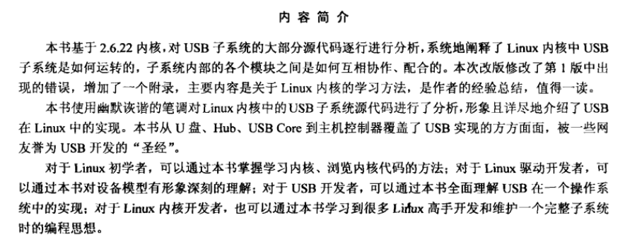

# linux-usb-2.6.22


本仓库已经开始作为GitBook仓库，访问地址

<https://yifengyou.gitbooks.io/linux-usb-2-6-22/content/>

GitHub访问地址

<https://github.com/yifengyou/linux-usb-2.6.22/>

```
Something I hope you know before go into the coding~
First, please watch or star this repo, I'll be more happy if you follow me.
Bug report, questions and discussion are welcome, you can post an issue or pull a request.
```

## 参考书目



## 内容简介




## 目录

* 第1篇 linux那些事儿之我是usb core
  1. 引子 2
  2. 它从哪里来 2
  3. pk 2
  4. 漫漫辛酸路 3
  5. 我型我秀 3
  6. 我是一棵树 4
  7. 我是谁 7
  8. 好戏开始了 9
  9. 不一样的core 11
  10. 从这里开始 14
  11. 面纱 17
  12. 模型，又见模型 19
  13. 繁华落尽 23
  14. 接口是设备的接口 24
  15. 设置是接口的设置 28
  16. 端点 30
  17. 设备 32
  18. 配置 38
  19. 向左走，向右走 41
  20. 设备的生命线(一) 45
  21. 设备的生命线(二) 48
  22. 设备的生命线(三) 52
  23. 设备的生命线(四) 57
  24. 设备的生命线(五) 63
  25. 设备的生命线(六) 69
  26. 设备的生命线(七) 75
  27. 设备的生命线(八) 81
  28. 设备的生命线(九) 86
  29. 设备的生命线(十) 89
  30. 设备的生命线(十一) 94
  31. 驱动的生命线(一) 105
  32. 驱动的生命线(二) 110
  33. 驱动的生命线(三) 113
  34. 驱动的生命线(四) 117
  35. 字符串描述符 119
  36. 接口的驱动 127
  37. 还是那个match 129
  38. 结束语 134
* 第2篇 linux那些事儿之我是hub
  1. 引子 136
  2. 跟我走吧，现在就出发 136
  3. 特别的爱给特别的root hub 137
  4. 一样的精灵，不一样的api 138
  5. 那些队列，那些队列操作函数 142
  6. 等待，只因曾经承诺 146
  7. 最熟悉的陌生人——probe 148
  8. 蝴蝶效应 151
  9. while you were sleeping(一) 154
  10. while you were sleeping(二) 159
  11. while you were sleeping(三) 160
  12. while you were sleeping(四) 165
  13. 再向虎山行 168
  14. 树，是什么样的树 172
  15. 没完没了的判断 174
  16. 一个都不能少 179
  17. 盖茨家对linux代码的影响 187
  18. 八大重量级函数闪亮登场(一) 191
  19. 八大重量级函数闪亮登场(二) 193
  20. 八大重量级函数闪亮登场(三) 195
  21. 八大重量级函数闪亮登场(四) 205
  22. 八大重量级函数闪亮登场(五) 209
  23. 是月亮惹的祸还是spec的错 216
  24. 所谓的热插拔 218
  25. 不说代码说理论 221
  26. 看代码的理由 225
  27. 电源管理的四大消息 229
  28. 将suspend分析到底 232
  29. 梦醒时分 241
  30. 挂起自动化 254
* 第3篇 linux那些事儿之我是u盘
  1. 小城故事 264
  2. makefile 264
  3. 变态的模块机制 266
  4. 想到达明天现在就要启程 268
  5. 外面的世界很精彩 269
  6. 未曾开始却似结束 270
  7. 狂欢是一群人的孤单 271
  8. 总线、设备和驱动(上) 272
  9. 总线、设备和驱动(下) 273
  10. 我是谁的他 274
  11. 从协议中来，到协议中去(上) 275
  12. 从协议中来，到协议中去(中) 277
  13. 从协议中来，到协议中去(下) 279
  14. 梦开始的地方 280
  15. 设备花名册 284
  16. 冰冻三尺非一日之寒 285
  17. 冬天来了，春天还会远吗？(一) 288
  18. 冬天来了，春天还会远吗？(二) 294
  19. 冬天来了，春天还会远吗？(三) 297
  20. 冬天来了，春天还会远吗？(四) 298
  21. 冬天来了，春天还会远吗？(五) 301
  22. 通往春天的管道 306
  23. 传说中的urb 310
  24. 彼岸花的传说(一) 312
  25. 彼岸花的传说(二) 313
  26. 彼岸花的传说(三) 316
  27. 彼岸花的传说(四) 319
  28. 彼岸花的传说(五) 321
  29. 彼岸花的传说(六) 325
  30. 彼岸花的传说(七) 327
  31. 彼岸花的传说(八) 330
  32. 彼岸花的传说(the end) 333
  33. scsi命令之我型我秀 334
  34. 迷雾重重的批量传输(一) 337
  35. 迷雾重重的批量传输(二) 341
  36. 迷雾重重的批量传输(三) 344
  37. 迷雾重重的批量传输(四) 348
  38. 迷雾重重的批量传输(五) 353
  39. 迷雾重重的批量传输(六) 356
  40. 迷雾重重的批量传输(七) 358
  41. 跟着感觉走(一) 362
  42. 跟着感觉走(二) 365
  43. 有多少爱可以胡来？(一) 370
  44. 有多少爱可以胡来？(二) 374
  45. 当梦醒了天晴了 378
  46. 其实世上本有路，走的人多了，也便没了路 381
* 附录a linux那些事儿之我是sysfs
  - a.1 sysfs初探 386
  - a.2 设备模型 387
  - a.2.1 设备底层模型 387
  - a.2.2 设备模型上层容器 391
  - a.2.3 示例一：usb子系统 394
  - a.2.4 示例二：usb storage驱动 398
  - a.3 sysfs文件系统 404
  - a.3.1 文件系统 405
  - a.3.2 sysfs 409
  - a.3.3 file_oprations 413
* 附录b linux内核高效学习法
  - b.1 高效学习linux内核 420
  - b.2 kernel地图：kconfig与makefile 421
  - b.3 分析内核源码如何入手 423
  - b.3.1 分析readme 423
  - b.3.2 分析kconfig和makefile 425
  - b.3.3 态度决定一切：从初始化函数开始 427
  - b.4 内核学习的心理问题 432
  - b.5 高效学习linux驱动开发 433
  - b.6 设备模型(上) 434
  - b.7 设备模型(下) 438
  - b.7.1 内核中usb子系统的结构 438
  - b.7.2 usb子系统与设备模型 440
  - b.8 驱动开发三件宝 440
