# 第1篇-linux那些事儿之我是usb-core

* 1994年11月，互联网巨头联合推出USB，并于1995年11月定制了0.9版USB.
* 1996年，推出USB 1.0版本
* 1998年，USB 1.1诞生
* 1999年，USB 2.0，理论速度达到480MB/s
* 2008年，USB 3.0 十倍速度于2.0
* 各个USB版本相互兼容

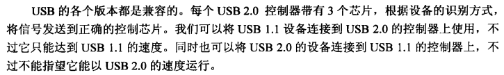

* Linux抢先Windows前，提前在2.6.31内核中推出USB 3.0的支持。
* USB支持热拔插，支持127个设备，支持多种传输速率，可以保持固定带宽，支持多功能设备。

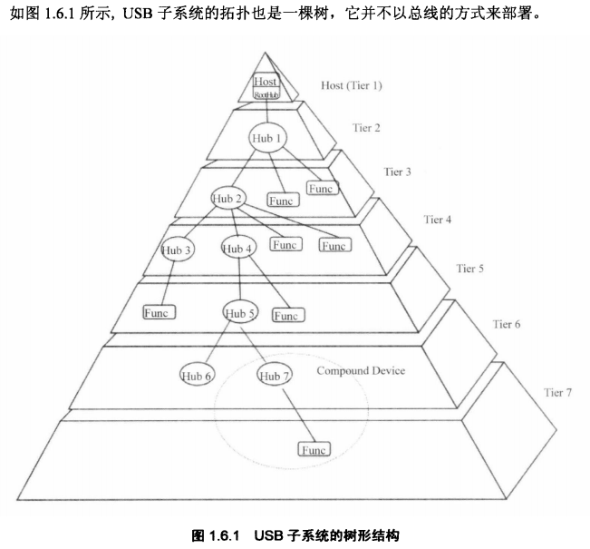

* USB子系统包括USB连接、USB主机控制器和USB设备。
* 控制器可以理解成辅助CPU，CPU助理

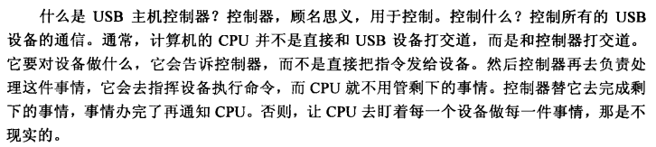

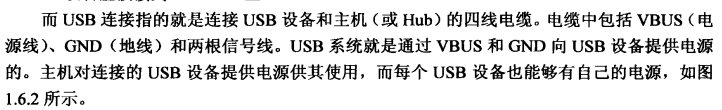

* Hub就是扩展槽

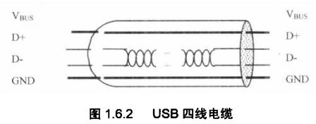

* USB总线是轮询总线，USB协议规定所有数据传输都必须由主机发起，由主机控制器初始化所有的数据传输。

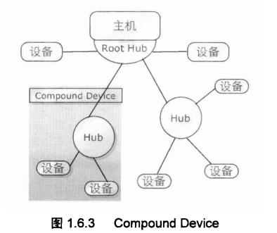

## USB-Core

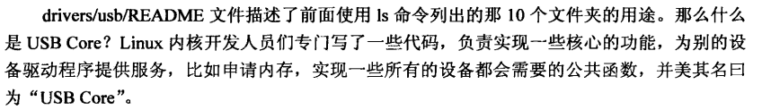

* 因为USB架构越发复杂，代码堆砌，特地在/deivers/usb下创建core子目录，专门存放核心代码
* 核心代码初始化整个USB系统，初始化Root Hub，初始化主机控制器代码
* 主机控制器也因为技术更新出现好几种，毕竟是硬件，就把公共部分放到core，特殊的地方放到host目录下。

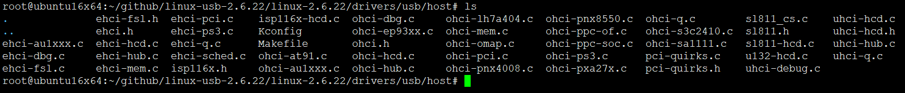

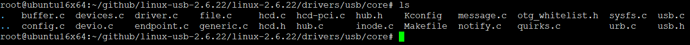

* 根据文件名就很明显可以推断出，core干了啥，无非就是内存相关，申请缓存，创建节点，总线控制器等相关代码。

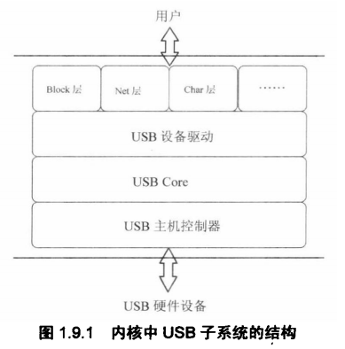

## USB-gadget

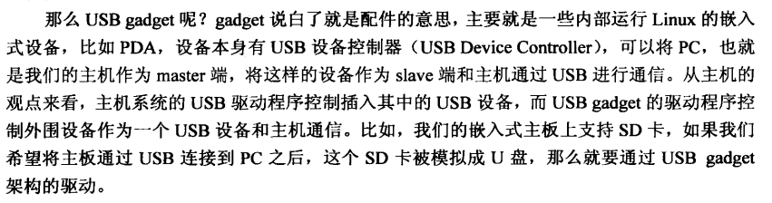

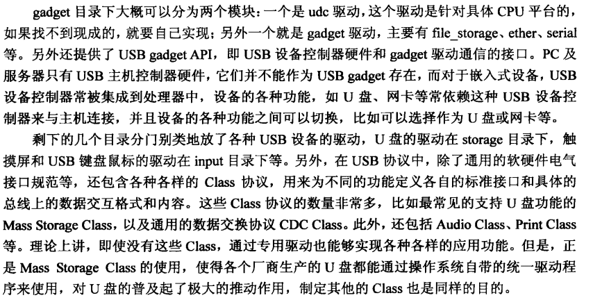

* Linux-USB Gadget 驱动框架（以下简称 Gadget ）实现了 USB 协议定义的设备端的软件功能。相对于 Linux USB 主机端（ Host ） 驱动而言， Gadget 驱动出现较晚，它出现在 2.4.23 以后
* 普通的 Gadget 驱动只实现一个功能（比如， u 盘， usb 网卡）。复合设备可以支持多个功能，后面将仔细研究一下复合设备的实现。像智能手机 , PDA 这样的设备，硬件支持较丰富的端点、 DMA Buffer, 给软件提了支持复合功能的基础。

## END
